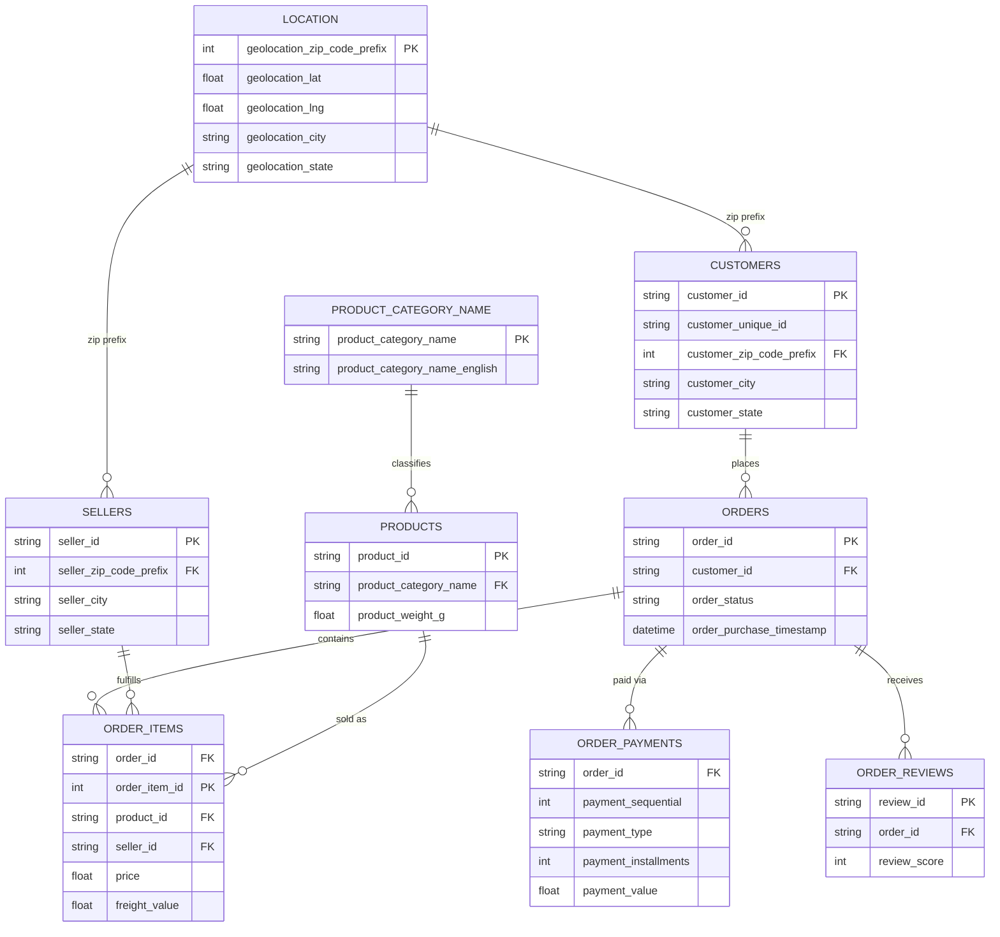

# Data Directory

## customers

| Column | Type | Notes |
|---|---|---|
| customer_id | string | Primary key, one row per order-customer record. 99,441 unique values. |
| customer_unique_id | string | Persistent identifier for the actual person across orders. Only 96,096 unique values against 99,441 customer_id values — **confirms customer_id is order-scoped, not a stable person-level key; use customer_unique_id for lifetime/repeat-purchase analysis.** |
| customer_zip_code_prefix | integer | First 5 digits of the Brazilian zip code. Joins to `location.geolocation_zip_code_prefix`. |
| customer_city | string | Free-text city name, lowercase. |
| customer_state | string | 2-letter Brazilian state code (e.g. SP, RJ). |

## orders

| Column | Type | Notes |
|---|---|---|
| order_id | string | Primary key. 99,441 unique values. |
| customer_id | string | Foreign key to `customers.customer_id`. |
| order_status | string | e.g. delivered, shipped, canceled, unavailable. 97.04% of orders are `delivered`. |
| order_purchase_timestamp | datetime | **Stored as text in the raw file — cast to datetime before any time-based analysis.** |
| order_approved_at | datetime | 160 nulls — orders never approved (canceled/failed payment). |
| order_delivered_carrier_date | datetime | 1,783 nulls — order not yet handed to carrier. |
| order_delivered_customer_date | datetime | 2,965 nulls — order not yet delivered or lost in transit. |
| order_estimated_delivery_date | datetime | No nulls. |

## order_items

| Column | Type | Notes |
|---|---|---|
| order_id | string | Foreign key to `orders.order_id`. 98,666 unique orders — fewer than `orders.order_id` because a small number of orders have no line items. |
| order_item_id | integer | Line-item sequence number within an order (1, 2, 3…). 21 distinct values — max 21 items on a single order. |
| product_id | string | Foreign key to `products.product_id`. |
| seller_id | string | Foreign key to `sellers.seller_id`. |
| shipping_limit_date | datetime | Seller's shipping deadline. |
| price | float | Item price, excludes freight. Right-skewed: median 74.99 vs mean 120.65. |
| freight_value | float | Freight cost for this line item. Right-skewed: median 16.26 vs mean 19.99. |

## order_payments

| Column | Type | Notes |
|---|---|---|
| order_id | string | Foreign key to `orders.order_id`. 99,440 unique orders — orders can have multiple payment rows (split/sequential payments). |
| payment_sequential | integer | Sequence number when an order uses more than one payment method. |
| payment_type | string | credit_card, boleto, voucher, debit_card, or not_defined. |
| payment_installments | integer | Range 0–24. **A value of 0 exists (0.19% of rows) — data-quality edge case worth excluding or flagging in installment-based analysis.** |
| payment_value | float | Right-skewed: median 100.00 vs mean 154.10, max 13,664.08. |

## order_reviews

| Column | Type | Notes |
|---|---|---|
| review_id | string | 98,410 unique values — some duplication (a small number of orders were reviewed more than once). |
| order_id | string | Foreign key to `orders.order_id`. 98,673 unique orders. |
| review_score | integer | 1–5. Mean 4.09, median 5 — reviews skew positive. |
| review_comment_title | string | Free text. Mostly null — most reviewers don't add a title. |
| review_comment_message | string | Free text. Mostly null — most reviewers don't add a message. |
| review_creation_date | datetime | Stored as text in the raw file — cast to datetime before use. |
| review_answer_timestamp | datetime | Stored as text in the raw file — cast to datetime before use. |

## location

| Column | Type | Notes |
|---|---|---|
| geolocation_zip_code_prefix | integer | Joins to `customers.customer_zip_code_prefix` and `sellers.seller_zip_code_prefix`. Not unique — many lat/long points per zip prefix. |
| geolocation_lat | float | Latitude. |
| geolocation_lng | float | Longitude. |
| geolocation_city | string | Free-text city name. |
| geolocation_state | string | 2-letter state code. |
| — | — | **Raw file has 1,000,163 rows with 261,831 full-row duplicates (26%) — deduplicate to 738,332 rows before joining, or distance/zip-level aggregations will be inflated.** |

## product_category_name

| Column | Type | Notes |
|---|---|---|
| product_category_name | string | Category name in Portuguese. Primary key, 71 rows — this is a lookup/translation table, not a transactional one. |
| product_category_name_english | string | English translation, used for all reporting labels. |

## products

| Column | Type | Notes |
|---|---|---|
| product_id | string | Primary key. 32,951 unique values. |
| product_category_name | string | Foreign key to `product_category_name.product_category_name`. **Some products have a null category — excluded from category-level cross-sell and revenue-by-category analysis.** |
| product_name_lenght | float | Character count of the product name (source column name is misspelled "lenght" — kept as-is to match the raw file). |
| product_description_lenght | float | Character count of the description. |
| product_photos_qty | float | Number of product photos. |
| product_weight_g | float | Weight in grams. |
| product_length_cm | float | |
| product_height_cm | float | |
| product_width_cm | float | |

## sellers

| Column | Type | Notes |
|---|---|---|
| seller_id | string | Primary key. 3,095 unique values. |
| seller_zip_code_prefix | integer | Joins to `location.geolocation_zip_code_prefix`. |
| seller_city | string | Free-text city name. |
| seller_state | string | 2-letter state code. Heavily concentrated in SP (São Paulo). |

## Entity Relationships

