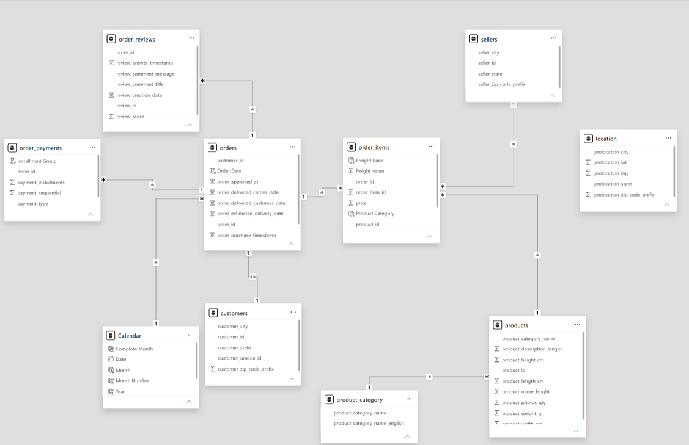

# Seller Concentration & Freight Risk Analysis

An end-to-end analysis of a 100K-order e-commerce marketplace, built to answer questions most public analyses of this dataset skip: how dependent the platform is on its top sellers, how much cross-state shipping actually costs, and how much cross-sell opportunity is going untapped.

## The Business Problem

67.5% of marketplace revenue sits with the top 10% of sellers, cross-state freight costs are significantly higher than same-state freight, and only 1% of orders span more than one product category. Full problem framing and scope: [`05_Documentation/Business_Problem.md`](05_Documentation/Business_Problem.md).

## What's in this repo 

```
├── 01_Dataset/                              (raw source CSVs + data dictionary)
│   ├── .gitattributes                       (Git LFS config for large CSVs)
│   ├── Data_Directory.md                    (column-level data dictionary + ER diagram)
│   ├── customers.csv                        (customer records, order-scoped + unique ID)
│   ├── location.csv                         (zip-code prefix geolocation lookup)
│   ├── order_items.csv                      (order line items: price, freight, seller)
│   ├── order_payments.csv                   (payment method, installments, value)
│   ├── order_reviews.csv                    (review scores, titles, comments)
│   ├── orders.csv                           (order status + lifecycle timestamps)
│   ├── product_category_name.csv            (category name PT → EN translation)
│   ├── products.csv                         (product category + physical attributes)
│   └── sellers.csv                          (seller location)
├── 02_SQL/
│   └── Business_Solution.sql                (20 business questions across 4 workstreams)
├── 03_Python/
│   ├── Exploratory_Data_Analysis.ipynb      (profiling, nulls, duplicates, type fixes)
│   └── Statistical_Analysis.ipynb           (descriptive, distribution, outlier, correlation, CI)
├── 04_PowerBI/
│   ├── Cross-Sell & Growth.png              (dashboard export)
│   ├── Data_Model.png                       (relational schema, Power BI view)
│   ├── Freight & Logistics Risk.png         (dashboard export)
│   ├── Marketplace Executive Overview.png   (dashboard export)
│   ├── Payment & Installment Risk.png       (dashboard export)
│   ├── Seller Concentration & Dependency.png (dashboard export)
│   └── Seller_Concentration___Freight_Risk_Analysis.pbix (Power BI source file, all 5 dashboards)
├── 05_Documentation/
│   ├── Business_Problem.md                  (problem statement & workstream scope)
│   ├── KPI_Definitions.md                   (every dashboard KPI, defined + formula)
│   └── business_conclusion_report.pdf       (full write-up: EDA, stats, insights, recommendations)
└── LICENSE
```

## Data Model



Nine relational tables — customers, orders, order_items, order_payments, order_reviews, products, product_category_name, sellers, and location — joined as shown above. Full column definitions and data-quality notes: [`01_Dataset/Data_Directory.md`](01_Dataset/Data_Directory.md).

## Dashboards

**Marketplace Executive Overview** — revenue, order volume, and delivery performance at a glance.


**Seller Concentration & Dependency** — revenue concentration across the seller base.


**Freight & Logistics Risk** — freight cost by distance, state, and price band.


**Payment & Installment Risk** — payment method mix and installment exposure.


**Cross-Sell & Growth** — category-spanning orders and revenue growth trend.


## Key Findings

- The top 10% of sellers generate **67.5%** of marketplace revenue; the top 10 sellers alone account for **13.15%**.
- Cross-state shipments cost significantly more in freight than same-state shipments (Welch's t-test, p < 0.001).
- **16.57%** of item revenue is consumed by freight cost in aggregate; **10.62%** of order items are classified as high-freight.
- **30.65%** of payment value is split across 7+ installments — a meaningful deferred-revenue exposure.
- Only **1.0%** of orders span more than one product category, despite many customers buying across categories over their lifetime.
- Revenue growth has gone from a steady 2017 climb to a **-4.56%** contraction in the most recent period.

Full analysis, statistical validation, and business recommendations: [`05_Documentation/business_conclusion_report.pdf`](05_Documentation/business_conclusion_report.pdf).

## Tech Stack

SQL Server · Python (pandas, seaborn, scipy) · Power BI · Jupyter
